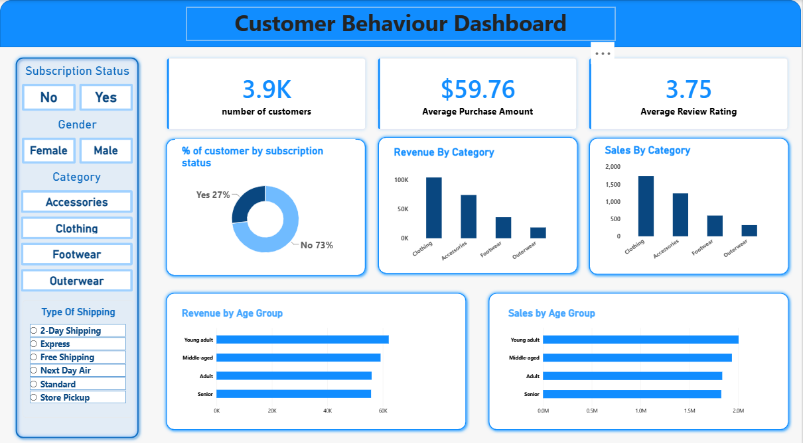

# Retail_Customer_Behaviour_Analytics_Platform
> An end-to-end Data Analytics project that analyzes customer purchasing behavior using Python, PostgreSQL, SQL, and Power BI to uncover business insights, customer segments, spending patterns, and product performance.

---

## 📌 Project Overview

This project analyzes customer shopping behavior using transactional retail data containing **3,900 customer purchases** across multiple product categories.

The objective is to transform raw transactional data into actionable business insights by:

- Cleaning and preparing data using Python
- Storing and querying data in PostgreSQL
- Performing business-focused SQL analysis
- Building an interactive Power BI dashboard
- Generating data-driven recommendations

---

## 🎯 Business Objectives

✔ Understand customer purchasing behavior

✔ Identify high-value customer segments

✔ Analyze product performance and customer preferences

✔ Evaluate subscription effectiveness

✔ Discover revenue-driving customer groups

✔ Support strategic business decision-making

---

# 🏗️ Project Architecture

```text
Raw CSV Dataset
       │
       ▼
🐍 Python (Data Cleaning & Feature Engineering)
       │
       ▼
🐘 PostgreSQL Database
       │
       ▼
📝 SQL Business Analysis
       │
       ▼
📊 Power BI Dashboard
       │
       ▼
💡 Business Recommendations
```

---

# 🛠️ Tech Stack

| Category | Tools |
|-----------|---------|
| Programming | Python |
| Data Processing | Pandas, NumPy |
| Database | PostgreSQL |
| Query Language | SQL |
| Visualization | Power BI |
| Version Control | Git, GitHub |

---

# 📂 Dataset Information

### Dataset Summary

| Metric | Value |
|----------|----------|
| Rows | 3,900 |
| Columns | 18 |
| Data Type | Customer Transaction Data |
| Missing Values | Review Rating Column |

### Key Features

#### 👤 Customer Information
- Customer ID
- Age
- Gender
- Location
- Subscription Status

#### 🛒 Purchase Information
- Item Purchased
- Category
- Purchase Amount
- Season
- Size
- Color

#### 📈 Shopping Behavior
- Discount Applied
- Promo Code Used
- Previous Purchases
- Purchase Frequency
- Review Rating
- Shipping Type

---

# 🧹 Data Cleaning & Preparation

The dataset was cleaned and transformed using Python.

### Steps Performed

✅ Checked data structure and summary statistics

✅ Handled missing values in review ratings

✅ Standardized column names to snake_case

✅ Created customer age groups

✅ Created purchase frequency metrics

✅ Removed redundant columns

✅ Performed consistency validation

✅ Loaded cleaned dataset into PostgreSQL

---

# ⚙️ Feature Engineering

### Created New Features

### Age Groups

Customers were segmented into:

- Young Adult
- Adult
- Middle-aged
- Senior

### Purchase Frequency

Created derived metrics to better understand customer engagement patterns.

---

# 🗄️ Database Design

### PostgreSQL Database

The cleaned dataset was loaded into PostgreSQL for advanced business analysis.

### Workflow

```sql
CSV Dataset
    ↓
Python ETL
    ↓
PostgreSQL
    ↓
SQL Analysis
    ↓
Power BI
```

---

# 📊 SQL Business Analysis

The following business questions were answered using SQL.

---

## 1️⃣ Revenue by Gender

Analyze total revenue generated by male and female customers.

### Business Value

Understand which customer group contributes more to revenue.

---

## 2️⃣ High-Spending Discount Users

Identify customers who:

- Used discounts
- Still spent above average purchase amounts

### Business Value

Discover high-value customers who respond to promotions.

---

## 3️⃣ Top Rated Products

Identify products with the highest average review ratings.

### Business Value

Highlight products with strong customer satisfaction.

---

## 4️⃣ Shipping Type Analysis

Compare spending patterns across shipping methods.

### Business Value

Evaluate whether faster shipping influences spending behavior.

---

## 5️⃣ Subscription Analysis

Compare:

- Total Revenue
- Average Spend
- Customer Count

between:

- Subscribers
- Non-Subscribers

### Business Value

Measure effectiveness of subscription programs.

---

## 6️⃣ Discount Dependency Analysis

Identify products most frequently purchased with discounts.

### Business Value

Understand product sensitivity to promotions.

---

## 7️⃣ Customer Segmentation

Customers were classified as:

| Segment | Description |
|----------|-------------|
| New | First-time customers |
| Returning | Repeat customers |
| Loyal | Frequent customers |

### Business Value

Support targeted marketing campaigns.

---

## 8️⃣ Top Products by Category

Identify the most purchased products within each category.

### Business Value

Optimize inventory and marketing strategies.

---

## 9️⃣ Repeat Buyers & Subscription Trends

Analyze subscription adoption among repeat buyers.

### Business Value

Improve customer retention initiatives.

---

## 🔟 Revenue by Age Group

Measure revenue contribution from each age segment.

### Business Value

Focus marketing efforts on high-value demographics.

---

# 📈 Power BI Dashboard

## Dashboard Overview

An interactive Power BI dashboard was developed to visualize customer behavior and business performance.

### Dashboard Features

📌 Total Customers

📌 Average Purchase Amount

📌 Average Product Rating

📌 Revenue by Category

📌 Sales by Category

📌 Revenue by Age Group

📌 Sales by Age Group

📌 Subscription Analysis

📌 Interactive Filters & Slicers

---

## 🖼️ Dashboard Screenshot

<p align="center">
  
</p>

---

# 💡 Key Insights

### 👥 Customer Segmentation

- Loyal customers represent the largest customer segment.
- Returning customers contribute significantly to recurring revenue.

### 💰 Revenue Analysis

- Certain age groups generate substantially higher revenue.
- Revenue distribution varies across customer demographics.

### 🛍️ Product Performance

- Several products consistently receive higher ratings.
- Product demand varies by category.

### 🎟️ Discount Impact

- Some products show strong dependence on discounts.
- Promotional campaigns influence purchasing behavior.

### ⭐ Customer Satisfaction

- Product ratings reveal customer preferences and satisfaction trends.

---

# 🚀 Business Recommendations

### 🎯 Increase Subscription Adoption

Offer exclusive discounts and loyalty benefits for subscribers.

### 🎯 Strengthen Customer Loyalty Programs

Reward repeat customers and encourage long-term engagement.

### 🎯 Optimize Promotional Strategies

Reduce excessive discount dependency where possible.

### 🎯 Promote Top-Rated Products

Feature highly-rated products in marketing campaigns.

### 🎯 Target High-Revenue Demographics

Focus campaigns on customer groups generating the highest revenue.

---

# 📁 Project Structure

```text
Retail_Customer_Behaviour_Analytics_Platform/
├── README.md
├── business_statement/
│   └── Business Problem  Document (1).pdf
├── powerbi_dashboard/
│   ├── customer_retail_dashboard.pbix
│   └── dashboard.png
├── python_scripts/
│   └── Customer_Shopping_Behavior_Analysis.ipynb
├── raw_dataset/
│   └── customer_shopping_behavior.csv
└── sql_cleaning/
    └── SQL_queries.sql

```

---

# 👨‍💻 Author

**Sayandh S**

🎓 B.Tech Information Technology Graduate

📊 Aspiring Data Analyst | Data Engineer

🛠️ SQL • PostgreSQL • Python • Power BI • Excel
